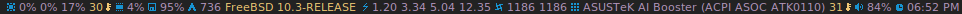
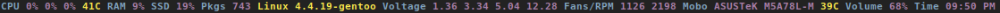
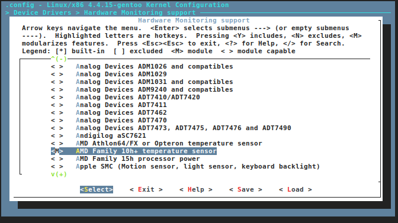
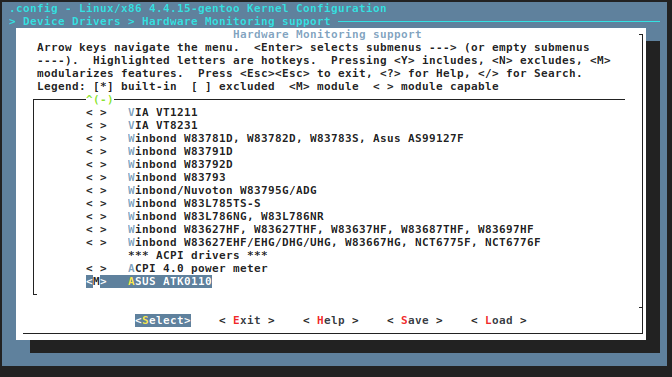
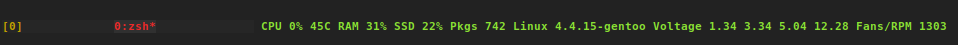

dwm


xmonad




ncurses




Gather some system information and show it in this statusbar program, not tied to any Window Manager, terminal multiplexer, etc.

Please note that the program won't detect fans connected via molex connetor(s) or external fan controller. Also I have not tested it with fan splitter(s) either.

The program is smart enough to detect whether some of your fan(s) blades are spinning, or the particular fan have been removed. Hold down some of your fan blades and you'll see that the program won't include this fan and it's RPM, release the blades and you'll see the fan and it's RPM in the statusbar. Try simulating real fan hardware failure by holding down all system fan blades and watch what the program will show you, just try not to slice your cheesy fingers open in the process.

If any of the 50+ options doesn't satisfy you, you can extend pinky-bar with your own crafted perl/python script.

If you compile your kernel from source code make sure to include your cpu and motherboard sensors as **modules** and not inlined.

**Just an example if you use BSD - acpi/aibs, coretemp/amdtemp.**





---

## Bandwidth measurment

pinky-bar supplies bandwitdh/network throughput measurment to satisfy those users that pay for overpriced 3G/mobile internet, and want to monitor every single megabit/megabyte.

## Program options

The order of supplied options will dictate how, where and what system information to be shown.

| short option | long option | Descrtiption                                                       |
|--------------|-------------|--------------------------------------------------------------------|
| -M           | --mpd       | The song filename                                                  |
| -W           | --mpdtrack  | The song track name  (not available in cmus)                       |
| -x           | --mpdartist | The song artist(s) name(s)                                         |
| -X           | --mpdtitle  | The song title                                                     |
| -y           | --mpdalbum  | The song album name                                                |
| -Y           | --mpddate   | The song date                                                      |
| -c           | --cpu       | The current cpu load (summed up all cores/threads)                 |
| -L           | --coresload | Show the load regarding each individual cpu core/thread            |
| -T           | --cputemp   | The current cpu temperature                                        |
| -C           | --cpuspeed  | Show your maximum cpu clock speed in MHz, regardless of the used governor. Uses assembly. |
| -I           | --cpuinfo   | Detect your CPU vendor, stepping, family, clflush, l1/l2 cache and line size, physical cores, physical and virtual bits. Uses assembly. |
| -r           | --ramperc   | The used ram in percentage                                         |
| -J           | --ramtotal  | The total ram                                                      |
| -K           | --ramfree   | The free ram                                                       |
| -l           | --ramshared | The shared ram                                                     |
| -o           | --rambuffer | The buffer ram (not available in OpenBSD)                          |
| -s           | --driveperc | The used drive storage in percentage                               |
| -n           | --drivetotal| The total drive storage                                            |
| -N           | --drivefree | The free drive storage                                             |
| -O           | --driveavail| The available drive storage (total - used)                         |
|              | --drivetemp | Read the drive temperature from S.M.A.R.T                          |
| -g           | --battery   | The remaining battery charge                                       |
| -z           | --dvdstr    | The vendor and model name of your cdrom/dvdrom                     |
| -S           | --statio    | Read and written MBs to the drive so far [argument - sda]          |
| -p           | --packages  | The number of installed packages                                   |
| -P           | --kernsys   | The kernel name                                                    |
|              | --kernode   | The network node hostname                                          |
| -Q           | --kernrel   | The kernel release                                                 |
| -R           | --kernver   | The kernel version                                                 |
| -u           | --kernarch  | The machine architecture                                           |
| -k           | --kernel    | Combined kernel name and version                                   |
|              | --perl      | Extend pinkybar with your scripts written in perl, learn more from the Opt-in section.     |
|              | --python    | Extend pinkybar with your scripts written in python, learn more from the Opt-in section.     |
| -q           | --weather   | Show the temperature outside (some details must be provided)       |
| -U           | --uptime    | The system uptime                                                  |
| -w           | --loadavg   | The system average load for past 1, 5 and 15 minutes               |
| -v           | --voltage   | The system voltage                                                 |
| -f           | --fans      | All system fans and their speed in RPM                             |
| -m           | --mobo      | Show the motherboard name and vendor                               |
| -d           | --mobotemp  | The motherboard temperature                                        |
| -V           | --volume    | The sound volume level                                             |
| -t           | --time      | The current time                                                   |
| -a           | --ipaddr    | The local ip address [argument - eth0]                             |
| -b           | --bandwitdh | The consumed internet bandwidth so far [argument - eth0]           |
| -i           | --iface     | The current download and upload speed [argument - eth0]            |
| -A           | --ipmac     | The NIC mac address [argument - eth0]                              |
| -B           | --ipmask    | The NIC subnet mask [argument - eth0]                              |
| -D           | --ipcast    | The NIC broadcast address [argument - eth0]                        |
| -E           | --iplookup  | Mini website IP lookup [website argument - google.com]             |

Be aware of the options that mention **Uses assembly** are tested only on AMD and Intel CPUs (starting from pentium 4 onwards).

The following options are available only in Linux:

| short option | long option | Descrtiption                                                       |
|--------------|-------------|--------------------------------------------------------------------|
| -F           | --drivemodel| The vendor name of your drive [argument - sda]                     |
| -G           | --nicinfo   | The NIC vendor and model [argument - eth0]                         |
|              | --nicdrv    | The NIC driver [argument - eth0]                                   |
| -H           | --nicver    | The NIC version [argument - eth0]                                  |
| -e           | --iplink    | The NIC link speed (useful for wireless/wifi) [argument - eth0]    |
| -j           | --nicfw     | The NIC firmware [argument - eth0]                                 |
| -h           | --wifiname  | The name of currently connected wifi/wireless network [argument - wlan0]  |

The following options are available only to FreeBSD and OpenBSD:

| short option | long option | Descrtiption                                                       |
|--------------|-------------|--------------------------------------------------------------------|
| -j           | --nicgw     | The NIC gateway address [argument - re0]                           |
| -Z           | --swapused  | The used drive swap in MB                                          |
| -F           | --swaperc   | The used drive swap in percentage                                  |
| -h           | --swaptotal | The total drive swap                                               |
| -H           | --swapavail | The available drive swap (total - used)                            |

The following options are available only in OpenBSD:

| short option | long option | Descrtiption                                                       |
|--------------|-------------|--------------------------------------------------------------------|
| -l           | --ramused   | The used ram in MB                                                 |

---

## GNU Build System (configure) options

Before the source code is passed to the compiler, you can enable/disable the following **configure** options 
that will increase/reduce the number of dependencies required to compile the program.

It's up to you to decide which features suit you best.

| To include     | Not to include      | Descrtiption                                                                               |
|----------------|---------------------|--------------------------------------------------------------------------------------------|
| --with-x11     | --without-x11       | Enable it if you are using dwm.                                                            |
| --with-alsa    | --without-alsa      | To get the sound volume level.                                                             |
| --with-oss     | --without-oss       | To get the sound volume level in \*BSD.                                                    |
| --with-net     | --without-net       | Enable the internet related options.                                                       |
| --with-libnl   | --without-libnl     | Enable the wifi related options regarding chipsets supporting the cfg80211/mac80211 modules (linux only).  |
| --with-pci     | --without-pci       | To get the NIC vendor and model in linux                                                   |
| --with-dvd     | --without-dvd       | To get the cdrom/dvdrom vendor and model                                                   |
| --with-sensors | --without-sensors   | Alternative way to get the sensors values (linux only)                                     |
| --with-apm     | --without-apm       | APM power and resource management for laptops (FreeBSD only)                               |
| --with-ncurses | --without-ncurses   | Output the data to the terminal using the ncurses library, can be colorized                |
| --with-perl    | --without-perl      | Extend pinkybar with your own crafted scripts written in perl                              |
| perl\_script=/tmp/pinky.pl   |       | The location where your perl script resides, must be combined **--with-perl**              |
| --with-python2  | --without-python2  | Extend pinkybar with your own crafted scripts written in python2                           |
| --with-python3  | --without-python3  | Extend pinkybar with your own crafted scripts written in python3                           |
| python\_script=/tmp/pinky.py   |     | The location where your python script resides, must be combined either **--with-python2** or **--with-python3** |
| --with-weather | --without-weather   | The temperature outside  (some details must be provided)                                   |
| api\_town='London,uk'              | | Town and country code to use for temperature monitoring                                    |
| api\_key='123458976'               | | API key obtained after registering yourself in the weather website                         |
| --with-smartemp | --without-smartemp   | Read the drive temperature from S.M.A.R.T cross-platform available                       |
| --with-drivetemp | --without-drivetemp   | Read the drive temperature from S.M.A.R.T (linux only) uses curl                       |
| --with-drivetemp-light | --without-drivetemp-light   | Read the drive temperature from S.M.A.R.T (linux only) light version       |
| drive\_port='1234'  |                | Different TCP port to listen to for the drive temperature, default one is 7634, must be combined **with-drivetemp** or **with-drivetemp-light**   |
| --with-colours | --without-colours   | Colorize the output data.                                                                  |
| icons=/tmp     |                     | xbm icons that can be used by dzen2 for example. Discarded when **--with-x11** is used     |
| --with-mpd     | --without-mpd       | To see the currently played song name (if any).                                            |
| --prefix=/tmp  |                     | The directory where the program will be installed                                          |
| mobo\_sensor='dev.aibs.0'  |         | FreeBSD motherboard sensor module name to use in the sysctl calls. Read the FreeBSD installation below  |
| cpu\_sensor='dev.cpu.0.temperature' |  | FreeBSD cpu temperature module name to use in the sysctl calls . Read the FreeBSD installation below  |

By default, if **no** options are passed, the program will be compiled with/without:

```bash
--with-net --with-pci --without-alsa --without-x11 --without-mpd --without-colours --without-dvd --without-sensors --without-ncurses --without-weather --without-drivetemp --without-smartemp --without-perl --without-python2 --without-python3
```

Affects only FreeBSD users with laptops, **--without-apm** will compile the program with acpi support to obtain the current battery life.

**--without-mpd** will compile the program with cmus support, the options syntax stays as is.

The pci and sensors configure options will be discarded in \*BSD. If you supplied **--with-alsa** and **--with-oss** or used the port package with the ncurses dialogue, alsa will have higher precedence over OSS. By default the port package will have OSS selected and alsa unselected.

Affects only linux, **--with-pci** and or **--with-sensors** will substitute -O0 flag to mitigate bugs in GCC caused by -O2 optimizations. -O0 will optimize the compiled binary for file size, while -O2 will optimize it for speed. So don't be shocked to find out that **--without-pci --without-sensors** will cause the compiled binary to double it's size. If things doesn't improve with upcomining GCC releases I will temporary drop -O2.

Affects only linux users with wifi/wireless chipsets, run `lsmod|grep 802` and see whether your chipset uses cfg80211/mac80211. If that's so you can rely on libnl and enable **--with-libnl** configure options, otherwise your chipset probably still uses we/wext, so type **--without-libnl**.

Affects only linux users, **--with-drivetemp** pretty much locks you down to hddtemp. You can adjust the perl one liner script at the end of this README and compile the program **--with-smartemp**, so you can switch between hddtemp and smartmontools at any time without the need recompile pinkybar with different options. **--with-smartemp** only cares for the existance of /tmp/pinkytemp file.

**--with-weather** is using [dis url](http://openweathermap.org/current), register yourself there, create a new [API key](https://home.openweathermap.org/api\_keys) and supply them like dis to **configure**.

Don't just rush to register yourself, read carefully what the "Free" account limits are and take in account how often the program should call their api service. I'm not responsible if you exceeded the limits, you've been warned.

```bash
# Make sure it's working first
# curl 'http://api.openweathermap.org/data/2.5/weather?q=London,uk&units=metric&APPID=28459ae16e4b3a7e5628ff21f4907b6f'

# what to pass to configure
--with-weather api_town='London,uk' api_key='28459ae16e4b3a7e5628ff21f4907b6f'
```

---

## Installation for dwm

```bash
bash bootstrap distro
./configure --prefix=$HOME/.cache --with-x11 --with-alsa
make
make install
```

Copy the code from extra/scripts/dwm.sh or `exec` it from **xinitrc** or the script used to start dwm.

## Installation for xmonad (or other WM)

```bash
# Copy the xbm icons
mkdir -p --mode=700 $HOME/.xmonad/icons
cp -r extra/xbm_icons/*.xbm $HOME/.xmonad/icons

bash bootstrap distro

# disable X11, point the location to the icons
./configure --prefix=$HOME/.cache --without-x11 --with-alsa icons=$HOME/.xmonad/icons

# compile 'n install
make
make install
```

Copy the code from extra/scripts/xmonad.sh or `exec` it from **xinitrc** or the script used to start xmonad.

## Installation in FreeBSD

FreeBSD has no other way than using the module specific convention to query sysctl and obtain data from the sensors. Maintaining a list with all the possible module names and performing expensive sysctl calls in a loop to determine that X module is loaded into your system is no-go. Be prepared to spend a minute or two to find out some system information.

Let's say you are using dwm:

Determine the motherboard sensor module name.

```bash
sysctl -a|grep 'aibs'

dev.aibs.0.volt.0: 1356 850 1600
dev.aibs.0.volt.1: 3344 2970 3630
dev.aibs.0.volt.2: 5040 4500 5500
dev.aibs.0.volt.3: 12278 10200 13800
dev.aibs.0.temp.0: 39.0C 60.0C 95.0C
dev.aibs.0.temp.1: 38.0C 45.0C 75.0C
dev.aibs.0.fan.0: 1053 600 7200
dev.aibs.0.fan.1: 1053 600 7200
```

Copy only 'dev.MODULE.NUMBER' (if there is any number at all) and paste it into the **mobo\_sensor** option below.

Do the same for your cpu temperature, copy and paste the variable as is. **dev.cpu.0.temperature** below is provied as example.

```bash
bash bootstrap freebsd
./configure --prefix=$HOME/.cache --with-x11 --without-alsa --with-oss mobo_sensor='dev.aibs.0' cpu_sensor='dev.cpu.0.temperature'
make
make install
```

Send a request to the FreeBSD mailing list and request the OpenBSD sensors API to be ported.

## Installation in OpenBSD

Before even executing the **bootstrap** script, you'll have to do this:

```bash
# To detect the newer compiler that you are
# about to install
sed -i 's/#AC_PROG_CC(/AC_PROG_CC(/g' bootstrap

ls /usr/local/bin/automake-*
ls /usr/local/bin/autoconf-*

# Then replace the numbers below
export AUTOCONF_VERSION=2.69
export AUTOMAKE_VERSION=1.15

# Your call, gcc or llvm ?
pkg_add gcc
```

## pinky curses installation

```bash
bash bootstrap distro

# disable X11, enable the colours and ncurses opts.
./configure --prefix=$HOME/.cache --without-x11 --with-alsa --with-colours --with-ncurses

# compile 'n install
make all ncurses
make install
```

Copy the code from extra/scripts/pinky-curses.sh and extra/misc/.Xresources

Force your non xterm/urxvt terminal emulator to use the newer xterm/urxvt colours. You'll have to kill Xorg (simply logout and log back in), experienced people are using xrdb instead killing Xorg each time they do changes to such files.

pinky\_curses is standalone program not tied to pinky-bar.

```bash
# ^B - Blue , ^M - Magenta , ^Y - Yellow
while true; do echo "^BOh ^Mhello ^Ydear";sleep 1;done | ./pinky_curses
```

## Installation for anything else

pinky-bar is no longer tied to Window Managers only. With the addition of "without colours", the output can be shown in any program, just bear in mind that the more options you've supplied the more system information will be shown.



The installation steps:

```bash
bash bootstrap distro
./configure --prefix=$HOME/.cache --without-x11 --without-colours
make
make install
```

By choosing this 3rd installation method it is up to you where, how to start and use the system information that's produced by pinky-bar.

---

Replace **distro** with archlinux, debian, gentoo, slackware, rhel, frugalware, angstrom. Here's some short distros list of some popular distros that are based on another one:

- [x] archlinux based distros: parabola, chakra, manjaro
- [x] debian based distros: ubuntu, linux mint, trisquel, back track, kali linux, peppermint linux, solusos, crunchbang, deepin, elementary os, and the rest \*buntu based distros
- [x] gentoo based distros: funtoo, sabayon, calculate linux
- [x] slackware
- [x] rhel based distros: opensuse (uses rpm), fedora, fuduntu, mandriva, mandrake, viperr, mageia
- [x] frugalware
- [x] angstrom

Cannot list the \*BSD flavours as "distros", so they deserve own options:

- [x] freebsd
- [x] openbsd

---

## Linux Mandatory requirements

* gcc/clang
* glibc
* autoconf
* automake
* m4
* gawk

## \*BSD Mandatory requirements

* gcc/clang
* bash
* autoconf
* automake
* autoconf-wrapper
* automake-wrapper
* autoconf-archive
* argp-standalone
* libtool
* m4
* gawk

Some llvm and gcc versions will not check for headers and libraries in /usr/local, if that's the case for you, you should export the following environment variables:

```bash
export LDFLAGS='-L/usr/local/lib'
export CFLAGS='-I/usr/local/include'
```

After editing the wrong prototype I managed to stumbled upon a bug in OpenBSD's own libc.

**Warning !!! OpenBSD users !!!**

The majority of SCN\* macros differs from their PRI\* cousins. And I cannot guarantee the accuracy of fixed width integers when OpenBSD own libc managed to use different format specifiers. Read extra/misc/openbsd\_bugs.md for more details.

## Opt-in requirements

Linux camp:

The internet related options rely on headers provided iproute2.
By default the program will try to compile with those headers included.
If for any reason you would like to compile the program without internet related options, then pass **--without-net** to configure.

* iproute2

wifi/wireless chipsets supporting mac80211/cfg80211:

* libnl (>= 3.0)
* pkg-config

In Gentoo there are two versions of pkg-config. The first one is named dev-util/pkgconfig and the second one is dev-ruby/pkg-config. In order to use the first one, you'll have to export the pkg-config path to the following environment variable:

```bash
export PKG_CONFIG_PATH=/usr/bin/pkg-config
```

Then pass **--with-libnl** to configure.

To get the NIC vendor and model names:

* pciutils

Alternative way to obtain data from the sensors:

* lm\_sensors

To read the drive temperature from S.M.A.R.T **--with-drivetemp**:

* hddtemp
* curl

To read the drive temperature from S.M.A.R.T **--with-drivetemp-light**:

* hddtemp

The "light" version does not rely on curl, and will not force -O0 CFLAGS.

```bash
# --with-drivetemp-light
0.00s user 0.00s system 15% cpu 0.006

# --with-drivetemp
0.01s user 0.00s system 72% cpu 0.008
```

Try running hddtemp to see if it detects your drive, depending if it has temperature sensor in first place:

```bash
sudo hddtemp /dev/sda

WARNING: Drive /dev/sda doesn't appear in the database of supported drives
WARNING: But using a common value, it reports something.
WARNING: Note that the temperature shown could be wrong.
WARNING: See --help, --debug and --drivebase options.
WARNING: And don't forget you can add your drive to hddtemp.db
/dev/sda: Corsair Force GT:  23°C or °F
```

The message is pretty clear "don't forget to add your drive to hddtemp.db", first run the debug command to see which field is responsible to report your drive temperature, it should be in the range of 190 - 200:

```bash
# Copy the Model: line

sudo hddtemp --debug /dev/sda

================= hddtemp 0.3-beta15 ==================
Model: Corsair Force GT

field(1)         = 0
field(5)         = 0
field(9)         = 253
field(12)        = 237
field(171)       = 0
field(172)       = 0
field(174)       = 147
field(177)       = 1
field(181)       = 0
field(182)       = 0
field(187)       = 0
field(194)       = 22
field(195)       = 0
field(196)       = 0
field(201)       = 0
field(204)       = 0
field(230)       = 100
field(231)       = 0
field(233)       = 130
field(234)       = 216
field(241)       = 216
field(242)       = 151
```

Open up **/usr/share/hddtemp/hddtemp.db** and append the Model: line that you copied earlier with the correct field that reports your drive temperature.

```bash
"Corsair Force GT" 194 C "Corsair Force GT 120GB SSD"
```

Next run hddtemp in daemon mode so we can request the temperature back:

```bash
sudo hddtemp -d /dev/sda
```

Open up your browser and navigate to 127.0.0.1:7634 and you'll get instant temperature report back to you.

The "init" lock-in for those of you that cannot choose between udev or eudev puts me in position not rely on libatasmart, regardless how neat the library is. There is stripped example program in extra/misc/skdump.c if you are curious to check and test libatasmart.

Linux camp end.

To read the drive temperature from S.M.A.R.T **--with-smartemp**:

* smartmontools

smartmontools are not mandatory in OpenBSD, `atactl` does the same job.

Execute the following command as root `visudo` and append:

```bash
# 'frost' is my computer username
frost ALL=NOPASSWD:/usr/sbin/smartctl
```

Copy the code from extra/scripts/drive-temperature.sh or `exec` it from **xinitrc** or the script used to start your DE/WM.

To extend pinkybar with your own crafted perl or python script/program/chewbacca:

* perl

or

* python == 2.7

or

* python >= 3.3 (requires "hacks" which are not newbie friendly)

Have a look at extra/scripts/pinky{.py,.pl}, they serve as examples how to write the most basic scripts in order to extend pinkybar in python and/or perl. You can use both languages simultaneously.

python3 wants `PYTHONPATH` to be exported, you should copy it to your shell configuration file, so it's set right after you boot your toaster:

```bash
python3 -c 'import sys;print(":".join([x for x in sys.path]))'
export PYTHONPATH=... :/including/the/path/to/your/script

# On other hand to compile the program with python2, you should `unset`
# this environment variable

#~/pypi > python3 -c 'import sys;print(":".join([x for x in sys.path]))'             
#:/usr/lib64/python34.zip:/usr/lib64/python3.4:/usr/lib64/python3.4/plat-linux:/usr/lib64/python3.4/lib-dynload:/usr/lib64/python3.4/site-packages

#~/pypi > export PYTHONPATH=/usr/lib64/python34.zip:/usr/lib64/python3.4:/usr/lib64/python3.4/plat-linux:/usr/lib64/python3.4/lib-dynload:/usr/lib64/python3.4/site-packages:/home/frost/pypi

# ./configure ... --with-python3 python_script='/home/frost/pypi/multi.py'
```

To get the sound volume level:

* alsa-utils
* alsa-lib

Then pass **--with-alsa** to configure.

\*BSD users can use the baked OSS instead, pass **--without-alsa --with-oss** to configure instead.

To output the data to the terminal using the ncurses library:

* ncurses

To get the vendor and model name of your cdrom/dvdrom/blu-ray:

* libcdio
* libcddb

In linux **--without-dvd** will still compile the program with dvd support. Except it will be limited only to dvd support, it will try to parse the sr0 vendor and model name detected by the kernel.

The weather related options, please go back and read **Don't just rush to register yourself**:

* curl
* gzip

**Warning, I'm not responsible for any lawsuit towards you, neither encourage you to pirate content that is not licensed as free and/or for fair use.**

To see the currently played song name **--with-mpd**:

  Server side:

  * libmpdclient
  * mpd (can be build with soundcloud support)

  Client side:

  * libmpdclient
  * mpc/ncmpc/ncmpcpp, [and the rest](http://mpd.wikia.com/wiki/Clients)

To see the currently played song name **--without-mpd**:

* cmus

The "soundcloud" alternative that is supported in cmus and your mpd client will be to download **.m3u/.pls** files according to the [radio stream station](https://www.internet-radio.com) that you are interested to listen.

The FreeBSD users will notice that "mpd" is named "musicpd".

If you've never used mpd before copy the example configuration from extra/mpd according to your OS.

Keep an eye on the **log file size** if you are using raspberry pi (or equivalent device) that streams the music, make sure that it's deleted automatically if it exceeds some pre-defined size.

---

## WM specific requirements

If you would like the output to be shown in your Window Manager, those are the following requirements:

for non-dwm WM:

* dzen2

for dwm:

* libx11
* xorg-server

use **--without-colours** to skip the following step:

* dwm compiled with statuscolor patch. The colours in use are specified in your dwm config.h

## Wish list

As top priority:

It would be great if I had \*BSD compatible usb wifi dongle to add wifi options in pinky-bar.
